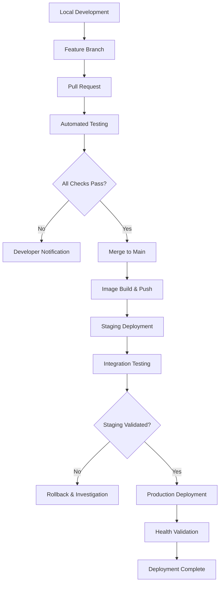

# Matrix Dashboard Project: Windows Development and Ubuntu Production Deployment Guide

## 1. Development Environment Setup (Windows)

### 1.1 Prerequisite Software Installation

```bash
# 1. Install Node.js (Recommended 20.x LTS)
# Download from: https://nodejs.org/
# Verify installation:
node --version
npm --version

# 2. Install Python 3.11+ (Required for Synapse)
# Download from: https://www.python.org/downloads/
# Verify installation:
python --version
pip --version

# 3. Install Git
# Download from: https://git-scm.com/
# Verify installation:
git --version

# 4. Install Docker Desktop
# Download from: https://www.docker.com/products/docker-desktop/
# Verify installation:
docker --version
docker-compose --version

# 5. Install PostgreSQL 15 (Optional - Docker alternative available)
# Download from: https://www.postgresql.org/download/windows/

# 6. Install Redis (Optional - Docker alternative available)
# Download from: https://github.com/microsoftarchive/redis/releases
```

### 1.2 Project Architecture

```bash
matrix-admin-system/
├── dashboard/                 # Dashboard Backend Service
│   ├── src/
│   ├── package.json
│   └── tsconfig.json
├── dashboard-frontend/        # React/Vue Frontend Application
│   ├── src/
│   ├── package.json
│   └── vite.config.ts
├── synapse-custom/            # Customized Synapse Homeserver
│   ├── dashboard_integration/
│   └── Additional Synapse modifications...
├── admin-bot/                 # Matrix Administration Bot
│   ├── src/
│   └── package.json
├── docker-compose.yml         # Development environment configuration
├── docker-compose.prod.yml    # Production environment configuration
├── migrations/                # Database schema migration scripts
├── scripts/                   # Deployment and utility scripts
└── docs/                      # Technical documentation
```

### 1.3 Windows-Specific Development Configuration

#### PowerShell Execution Policy Configuration
```powershell
# Enable script execution in PowerShell (Administrator privileges required)
Set-ExecutionPolicy -ExecutionPolicy RemoteSigned -Scope CurrentUser

# Development environment startup script
# scripts/start-dev.ps1
$env:NODE_ENV = "development"
$env:DEBUG = "matrix-dashboard:*"
cd dashboard
npm run dev
```

#### Cross-Platform Path Handling
```typescript
// Avoid platform-specific path implementations
// ❌ Platform-dependent implementation
const configPath = 'C:\\Users\\Admin\\config.json';

// ✅ Platform-agnostic implementation
import path from 'path';
import os from 'os';

const configPath = path.join(
  process.cwd(), 
  'config', 
  'config.json'
);

// ✅ Environment-based configuration
const configPath = process.env.CONFIG_PATH || 
  path.join(process.cwd(), 'config', 'config.json');
```

#### Git Configuration for Cross-Platform Development
```bash
# Configure Git for consistent line endings across platforms
git config --global core.autocrlf true

# Project-specific Git attributes
# .gitattributes
* text=auto
*.sh text eol=lf
*.ps1 text eol=crlf
*.js text eol=lf
*.ts text eol=lf
*.json text eol=lf
```

---

## 2. Version Control Strategy and Repository Management

### 2.1 Multi-Repository Architecture

```
GitHub Organization: matrix-org
├── matrix-dashboard           # Primary application repository
├── synapse-fork               # Customized Synapse homeserver
└── element-web-fork          # Modified Element Web client
```

### 2.2 Git Workflow Implementation

```bash
# 1. Clone primary repository
git clone https://github.com/matrix-org/matrix-dashboard.git
cd matrix-dashboard

# 2. Create feature branch from main
git checkout -b feature/room-management

# 3. Development cycle
git add .
git commit -m "feat: implement room moderation capabilities
- Add room suspension functionality
- Implement user reporting system
- Add audit logging for moderation actions"
git push origin feature/room-management

# 4. Create Pull Request for code review

# 5. Synchronize with upstream changes
git fetch upstream
git rebase upstream/main  # Prefer rebase for cleaner history
```

### 2.3 Synapse Customization Synchronization

```bash
# Synapse repository maintenance procedure
cd synapse-custom

# Configure upstream tracking
git remote add upstream https://github.com/element-hq/synapse.git

# Fetch latest upstream changes
git fetch upstream

# Rebase customizations on latest upstream
git checkout feature/dashboard-integration
git rebase upstream/develop

# Resolve conflicts and test integration
git push --force-with-lease origin feature/dashboard-integration
```

### 2.4 Automated Repository Synchronization

```powershell
# scripts/sync-upstream.ps1 - Windows synchronization utility
param(
    [switch]$Force = $false
)

Write-Host "Initiating upstream repository synchronization..." -ForegroundColor Green

try {
    # Validate git repository
    if (-not (Test-Path ".git")) {
        throw "Not a git repository"
    }

    # Synchronize main application
    Write-Host "Synchronizing matrix-dashboard..." -ForegroundColor Yellow
    git fetch upstream
    git merge --ff-only upstream/main
    
    if ($LASTEXITCODE -ne 0) {
        Write-Warning "Fast-forward merge failed. Consider manual intervention."
    }

    # Synchronize Synapse customization
    if (Test-Path "synapse-custom") {
        Write-Host "Synchronizing synapse-custom..." -ForegroundColor Yellow
        Push-Location synapse-custom
        git fetch upstream
        git rebase upstream/develop
        Pop-Location
    }

    Write-Host "Synchronization completed successfully!" -ForegroundColor Green
} catch {
    Write-Error "Synchronization failed: $($_.Exception.Message)"
    exit 1
}
```

```bash
#!/bin/bash
# scripts/sync-upstream.sh - Linux synchronization utility

set -euo pipefail

echo "Initiating upstream repository synchronization..."

# Validate execution context
if [ ! -d ".git" ]; then
    echo "Error: Not a git repository" >&2
    exit 1
fi

# Synchronize primary repository
echo "Synchronizing matrix-dashboard..."
git fetch upstream

if git merge-base --is-ancestor HEAD upstream/main; then
    git merge --ff-only upstream/main
else
    echo "Warning: Cannot fast-forward. Manual merge required."
    exit 1
fi

# Synchronize Synapse customization
if [ -d "synapse-custom" ]; then
    echo "Synchronizing synapse-custom..."
    cd synapse-custom
    git fetch upstream
    git rebase upstream/develop
    cd ..
fi

echo "Synchronization completed successfully!"
```

---

## 3. Cross-Platform Development Considerations

### 3.1 Environment Configuration Management

```typescript
// config/environment.ts - Environment variable management
export class EnvironmentConfig {
  private static getRequiredEnvVar(key: string): string {
    const value = process.env[key];
    if (!value) {
      throw new Error(`Required environment variable ${key} is not defined`);
    }
    return value;
  }

  private static getOptionalEnvVar(key: string, defaultValue: string = ''): string {
    return process.env[key] || defaultValue;
  }

  // Database configuration
  static get database() {
    return {
      host: this.getRequiredEnvVar('DB_HOST'),
      port: parseInt(this.getOptionalEnvVar('DB_PORT', '5432')),
      username: this.getRequiredEnvVar('DB_USERNAME'),
      password: this.getRequiredEnvVar('DB_PASSWORD'),
      database: this.getRequiredEnvVar('DB_NAME'),
    };
  }

  // Redis configuration
  static get redis() {
    return {
      host: this.getRequiredEnvVar('REDIS_HOST'),
      port: parseInt(this.getOptionalEnvVar('REDIS_PORT', '6379')),
      password: this.getOptionalEnvVar('REDIS_PASSWORD'),
    };
  }

  // Application configuration
  static get application() {
    return {
      nodeEnv: this.getOptionalEnvVar('NODE_ENV', 'development'),
      port: parseInt(this.getOptionalEnvVar('PORT', '3000')),
      jwtSecret: this.getRequiredEnvVar('JWT_SECRET'),
    };
  }
}
```

### 3.2 Filesystem Abstraction Layer

```typescript
// utils/filesystem.ts - Cross-platform filesystem operations
import fs from 'fs/promises';
import path from 'path';
import { constants } from 'fs';

export class FileSystem {
  /**
   * Recursively create directory structure
   */
  static async ensureDirectory(dirPath: string): Promise<void> {
    try {
      await fs.mkdir(dirPath, { recursive: true });
    } catch (error: any) {
      if (error.code !== 'EEXIST') {
        throw new Error(`Failed to create directory ${dirPath}: ${error.message}`);
      }
    }
  }

  /**
   * Platform-agnostic path resolution
   */
  static resolvePath(...segments: string[]): string {
    const resolvedPath = path.resolve(...segments);
    // Normalize to forward slashes for consistency
    return resolvedPath.replace(/\\/g, '/');
  }

  /**
   * Safe file read with error handling
   */
  static async readJSONFile<T>(filePath: string): Promise<T> {
    try {
      const content = await fs.readFile(filePath, 'utf-8');
      return JSON.parse(content) as T;
    } catch (error: any) {
      throw new Error(`Failed to read JSON file ${filePath}: ${error.message}`);
    }
  }

  /**
   * Check file accessibility
   */
  static async canAccess(filePath: string, mode: number = constants.F_OK): Promise<boolean> {
    try {
      await fs.access(filePath, mode);
      return true;
    } catch {
      return false;
    }
  }
}
```

### 3.3 Development Script Configuration

```json
{
  "scripts": {
    "dev": "nodemon --watch src --ext ts,json --exec ts-node src/app.ts",
    "build": "tsc && tsc-alias",
    "start": "node dist/app.js",
    "start:prod": "cross-env NODE_ENV=production node dist/app.js",
    "test": "cross-env NODE_ENV=test jest",
    "test:coverage": "cross-env NODE_ENV=test jest --coverage",
    "lint": "eslint src/**/*.ts",
    "lint:fix": "eslint src/**/*.ts --fix",
    "type-check": "tsc --noEmit",
    "docker:build": "docker build -t matrix-dashboard:latest .",
    "docker:run": "docker run -p 3000:3000 matrix-dashboard:latest"
  }
}
```

---

## 4. Production Deployment on Ubuntu

### 4.1 Infrastructure Provisioning Script

```bash
#!/bin/bash
# scripts/provision-ubuntu-server.sh

set -euo pipefail

LOG_FILE="/var/log/matrix-dashboard-provisioning.log"
TIMESTAMP=$(date +%Y%m%d_%H%M%S)

# Logging function
log() {
    echo "[$(date '+%Y-%m-%d %H:%M:%S')] $1" | tee -a "$LOG_FILE"
}

log "Starting Ubuntu server provisioning for Matrix Dashboard..."

# System update and upgrade
log "Updating system packages..."
apt-get update && apt-get upgrade -y

# Install Docker
log "Installing Docker..."
curl -fsSL https://get.docker.com -o get-docker.sh
sh get-docker.sh
usermod -aG docker "$USER"

# Install Docker Compose
log "Installing Docker Compose..."
DOCKER_COMPOSE_VERSION="v2.24.0"
curl -L "https://github.com/docker/compose/releases/download/${DOCKER_COMPOSE_VERSION}/docker-compose-$(uname -s)-$(uname -m)" \
    -o /usr/local/bin/docker-compose
chmod +x /usr/local/bin/docker-compose

# Install security updates
log "Installing security updates..."
apt-get install -y unattended-upgrades
dpkg-reconfigure -plow unattended-upgrades

# Configure firewall
log "Configuring firewall..."
ufw --force enable
ufw allow 22/tcp    # SSH
ufw allow 80/tcp    # HTTP
ufw allow 443/tcp   # HTTPS
ufw allow 8008/tcp  # Synapse (if exposed)
ufw allow 8448/tcp  # Synapse federation

# Create application directory structure
log "Creating application directory structure..."
mkdir -p /opt/matrix-dashboard/{data,logs,backups,ssl}
chown -R "$USER:$USER" /opt/matrix-dashboard

# Configure log rotation
cat > /etc/logrotate.d/matrix-dashboard << EOF
/opt/matrix-dashboard/logs/*.log {
    daily
    rotate 30
    compress
    delaycompress
    missingok
    notifempty
    create 644 $USER $USER
}
EOF

log "Server provisioning completed successfully!"
log "Please logout and login again to apply group membership changes."
```

### 4.2 Production Docker Compose Configuration

```yaml
# docker-compose.prod.yml
version: '3.8'

x-common-variables: &common-vars
  DB_HOST: postgres
  DB_PORT: 5432
  DB_USER: synapse
  DB_PASSWORD: ${DB_PASSWORD}
  REDIS_URL: redis://redis:6379

services:
  postgres:
    image: postgres:15-alpine
    environment:
      POSTGRES_DB: synapse
      POSTGRES_USER: synapse
      POSTGRES_PASSWORD: ${DB_PASSWORD}
      POSTGRES_INITDB_ARGS: "--encoding=UTF8 --lc-collate=C --lc-ctype=C"
    volumes:
      - postgres_data:/var/lib/postgresql/data
      - ./migrations:/docker-entrypoint-initdb.d:ro
    networks:
      - matrix-backend
    restart: unless-stopped
    healthcheck:
      test: ["CMD-SHELL", "pg_isready -U synapse -d synapse"]
      interval: 30s
      timeout: 10s
      retries: 3

  redis:
    image: redis:7-alpine
    command: >
      redis-server
      --appendonly yes
      --requirepass ${REDIS_PASSWORD}
    volumes:
      - redis_data:/data
    networks:
      - matrix-backend
    restart: unless-stopped
    healthcheck:
      test: ["CMD", "redis-cli", "--raw", "incr", "ping"]
      interval: 30s
      timeout: 3s
      retries: 3

  dashboard:
    image: ${DOCKER_REGISTRY}/matrix-dashboard:${DASHBOARD_VERSION:-latest}
    environment:
      <<: *common-vars
      NODE_ENV: production
      JWT_SECRET: ${JWT_SECRET}
      LOG_LEVEL: info
      CORS_ORIGIN: ${CORS_ORIGIN}
    ports:
      - "3000:3000"
    depends_on:
      postgres:
        condition: service_healthy
      redis:
        condition: service_healthy
    networks:
      - matrix-backend
    restart: unless-stopped
    logging:
      driver: "json-file"
      options:
        max-size: "10m"
        max-file: "3"

  admin-bot:
    image: ${DOCKER_REGISTRY}/admin-bot:${BOT_VERSION:-latest}
    environment:
      <<: *common-vars
      BOT_ACCESS_TOKEN: ${BOT_ACCESS_TOKEN}
      HOMESERVER_URL: ${HOMESERVER_URL}
      DASHBOARD_API_URL: http://dashboard:3000/api/v1
    depends_on:
      - dashboard
    networks:
      - matrix-backend
    restart: unless-stopped

  nginx:
    image: nginx:1.24-alpine
    ports:
      - "80:80"
      - "443:443"
    volumes:
      - ./nginx/nginx.conf:/etc/nginx/nginx.conf:ro
      - ./nginx/conf.d:/etc/nginx/conf.d:ro
      - /opt/matrix-dashboard/ssl:/etc/nginx/ssl:ro
      - /opt/matrix-dashboard/logs/nginx:/var/log/nginx
    depends_on:
      - dashboard
    networks:
      - matrix-backend
    restart: unless-stopped

volumes:
  postgres_data:
    driver: local
  redis_data:
    driver: local

networks:
  matrix-backend:
    driver: bridge
    ipam:
      config:
        - subnet: 172.20.0.0/16
```

### 4.3 Production Deployment Automation

```bash
#!/bin/bash
# scripts/deploy-production.sh

set -euo pipefail

SCRIPT_DIR="$(cd "$(dirname "${BASH_SOURCE[0]}")" && pwd)"
cd "$SCRIPT_DIR/.."

DEPLOY_TIMESTAMP=$(date +%Y%m%d_%H%M%S)
BACKUP_DIR="/opt/matrix-dashboard/backups/${DEPLOY_TIMESTAMP}"

# Load environment configuration
if [[ ! -f ".env" ]]; then
    echo "Error: .env configuration file not found" >&2
    exit 1
fi
source .env

log() {
    echo "[$(date '+%Y-%m-%d %H:%M:%S')] $1" | tee -a "/opt/matrix-dashboard/logs/deploy.log"
}

create_backup() {
    log "Creating pre-deployment backup..."
    mkdir -p "$BACKUP_DIR"
    
    # Database backup
    docker-compose -f docker-compose.prod.yml exec -T postgres \
        pg_dump -U synapse synapse > "${BACKUP_DIR}/synapse_pre_deploy.sql"
    
    # Redis backup
    docker-compose -f docker-compose.prod.yml exec -T redis \
        redis-cli --rdb - > "${BACKUP_DIR}/redis_pre_deploy.rdb" || true
    
    log "Backup created: ${BACKUP_DIR}"
}

perform_health_check() {
    local max_attempts=30
    local attempt=1
    
    log "Performing service health check..."
    
    while [[ $attempt -le $max_attempts ]]; do
        if curl -s -f "http://localhost:3000/health" > /dev/null; then
            log "Health check passed"
            return 0
        fi
        
        log "Health check attempt ${attempt}/${max_attempts} failed, retrying..."
        sleep 10
        ((attempt++))
    done
    
    log "Health check failed after ${max_attempts} attempts"
    return 1
}

main() {
    log "Starting production deployment..."
    
    # Pre-deployment validation
    if [[ -z "${DB_PASSWORD:-}" || -z "${JWT_SECRET:-}" ]]; then
        log "Error: Required environment variables not set"
        exit 1
    fi
    
    # Create backup
    create_backup
    
    # Pull latest images
    log "Pulling latest Docker images..."
    docker-compose -f docker-compose.prod.yml pull
    
    # Deploy new version
    log "Starting services..."
    docker-compose -f docker-compose.prod.yml up -d
    
    # Wait for services to initialize
    sleep 30
    
    # Perform health check
    if ! perform_health_check; then
        log "Deployment failed: Services unhealthy"
        exit 1
    fi
    
    # Run database migrations
    log "Running database migrations..."
    docker-compose -f docker-compose.prod.yml exec -T postgres \
        psql -U synapse -d synapse -f /docker-entrypoint-initdb.d/002_dashboard_schema_migration.sql
    
    # Clean up old backups (keep last 7)
    find /opt/matrix-dashboard/backups -maxdepth 1 -type d -name "2*" | \
        sort -r | tail -n +8 | xargs -r rm -rf
    
    log "Production deployment completed successfully"
}

main "$@"
```

### 4.4 Nginx Reverse Proxy Configuration

```nginx
# nginx/nginx.conf
user nginx;
worker_processes auto;
error_log /var/log/nginx/error.log warn;
pid /var/run/nginx.pid;

events {
    worker_connections 1024;
    use epoll;
    multi_accept on;
}

http {
    include /etc/nginx/mime.types;
    default_type application/octet-stream;

    log_format main '$remote_addr - $remote_user [$time_local] "$request" '
                    '$status $body_bytes_sent "$http_referer" '
                    '"$http_user_agent" "$http_x_forwarded_for" '
                    'rt=$request_time uct="$upstream_connect_time" '
                    'uht="$upstream_header_time" urt="$upstream_response_time"';

    access_log /var/log/nginx/access.log main;

    sendfile on;
    tcp_nopush on;
    tcp_nodelay on;
    keepalive_timeout 65;
    types_hash_max_size 2048;

    # Gzip compression
    gzip on;
    gzip_vary on;
    gzip_min_length 1024;
    gzip_proxied any;
    gzip_comp_level 6;
    gzip_types
        application/atom+xml
        application/javascript
        application/json
        application/ld+json
        application/manifest+json
        application/rss+xml
        application/vnd.geo+json
        application/vnd.ms-fontobject
        application/x-font-ttf
        application/x-web-app-manifest+json
        application/xhtml+xml
        application/xml
        font/opentype
        image/bmp
        image/svg+xml
        image/x-icon
        text/cache-manifest
        text/css
        text/plain
        text/vcard
        text/vnd.rim.location.xloc
        text/vtt
        text/x-component
        text/x-cross-domain-policy;

    # Security headers
    add_header X-Frame-Options "SAMEORIGIN" always;
    add_header X-Content-Type-Options "nosniff" always;
    add_header X-XSS-Protection "1; mode=block" always;
    add_header Referrer-Policy "strict-origin-when-cross-origin" always;
    add_header Content-Security-Policy "default-src 'self' http: https: data: blob: 'unsafe-inline'" always;

    # Rate limiting
    limit_req_zone $binary_remote_addr zone=api:10m rate=10r/s;
    limit_req_zone $binary_remote_addr zone=auth:10m rate=5r/m;

    include /etc/nginx/conf.d/*.conf;
}
```

```nginx
# nginx/conf.d/dashboard.conf
upstream dashboard_backend {
    server dashboard:3000 max_fails=3 fail_timeout=30s;
}

server {
    listen 80;
    server_name dashboard.example.com;
    return 301 https://$server_name$request_uri;
}

server {
    listen 443 ssl http2;
    server_name dashboard.example.com;

    ssl_certificate /etc/nginx/ssl/cert.pem;
    ssl_certificate_key /etc/nginx/ssl/key.pem;
    
    ssl_protocols TLSv1.2 TLSv1.3;
    ssl_ciphers ECDHE-RSA-AES256-GCM-SHA512:DHE-RSA-AES256-GCM-SHA512:ECDHE-RSA-AES256-GCM-SHA384:DHE-RSA-AES256-GCM-SHA384;
    ssl_prefer_server_ciphers off;
    ssl_session_cache shared:SSL:10m;
    ssl_session_timeout 10m;

    # HSTS header
    add_header Strict-Transport-Security "max-age=63072000; includeSubDomains; preload" always;

    client_max_body_size 10M;

    # API routes with rate limiting
    location /api/ {
        limit_req zone=api burst=20 nodelay;
        
        proxy_pass http://dashboard_backend;
        proxy_http_version 1.1;
        proxy_set_header Upgrade $http_upgrade;
        proxy_set_header Connection 'upgrade';
        proxy_set_header Host $host;
        proxy_set_header X-Real-IP $remote_addr;
        proxy_set_header X-Forwarded-For $proxy_add_x_forwarded_for;
        proxy_set_header X-Forwarded-Proto $scheme;
        proxy_cache_bypass $http_upgrade;
        proxy_read_timeout 300;
        proxy_connect_timeout 300;
        proxy_send_timeout 300;
    }

    # Authentication endpoints with stricter rate limiting
    location /api/v1/auth/ {
        limit_req zone=auth burst=5 nodelay;
        
        proxy_pass http://dashboard_backend;
        proxy_set_header Host $host;
        proxy_set_header X-Real-IP $remote_addr;
        proxy_set_header X-Forwarded-For $proxy_add_x_forwarded_for;
        proxy_set_header X-Forwarded-Proto $scheme;
    }

    # Health check endpoint (no rate limiting)
    location /health {
        access_log off;
        proxy_pass http://dashboard_backend;
        proxy_set_header Host $host;
    }

    # Static assets
    location /static/ {
        expires 1y;
        add_header Cache-Control "public, immutable";
        proxy_pass http://dashboard_backend;
    }

    # Frontend application
    location / {
        try_files $uri $uri/ /index.html;
        proxy_pass http://dashboard_backend;
        proxy_set_header Host $host;
        proxy_set_header X-Real-IP $remote_addr;
        proxy_set_header X-Forwarded-For $proxy_add_x_forwarded_for;
        proxy_set_header X-Forwarded-Proto $scheme;
    }
}
```

---

## 5. CI/CD Pipeline Implementation

### 5.1 Development to Production Workflow



### 5.2 GitHub Actions Pipeline Configuration

```yaml
# .github/workflows/ci-cd.yml
name: Matrix Dashboard CI/CD

on:
  push:
    branches: [ main, develop ]
  pull_request:
    branches: [ main ]

env:
  REGISTRY: ghcr.io
  IMAGE_NAME: ${{ github.repository }}

jobs:
  quality-checks:
    name: Code Quality & Security
    runs-on: ubuntu-latest
    
    steps:
    - name: Checkout code
      uses: actions/checkout@v4
      
    - name: Setup Node.js
      uses: actions/setup-node@v4
      with:
        node-version: '20.x'
        cache: 'npm'
        cache-dependency-path: dashboard/package-lock.json
        
    - name: Install dependencies
      run: |
        cd dashboard
        npm ci
      
    - name: Run TypeScript compiler
      run: |
        cd dashboard
        npm run type-check
      
    - name: Run ESLint
      run: |
        cd dashboard
        npm run lint
      
    - name: Run security audit
      run: |
        cd dashboard
        npm audit --audit-level high
      
    - name: Run SAST analysis
      uses: github/codeql-action/analyze@v3
      with:
        languages: javascript

  unit-tests:
    name: Unit & Integration Tests
    runs-on: ubuntu-latest
    
    services:
      postgres:
        image: postgres:15-alpine
        env:
          POSTGRES_PASSWORD: test_password
          POSTGRES_DB: test_dashboard
        options: >-
          --health-cmd pg_isready
          --health-interval 10s
          --health-timeout 5s
          --health-retries 5
        ports:
          - 5432:5432
          
      redis:
        image: redis:7-alpine
        options: >-
          --health-cmd "redis-cli ping"
          --health-interval 10s
          --health-timeout 5s
          --health-retries 5
        ports:
          - 6379:6379

    steps:
    - name: Checkout code
      uses: actions/checkout@v4
      
    - name: Setup Node.js
      uses: actions/setup-node@v4
      with:
        node-version: '20.x'
        cache: 'npm'
        cache-dependency-path: dashboard/package-lock.json
        
    - name: Install dependencies
      run: |
        cd dashboard
        npm ci
      
    - name: Run tests with coverage
      run: |
        cd dashboard
        npm run test:coverage
      env:
        NODE_ENV: test
        DB_HOST: localhost
        DB_PORT: 5432
        DB_USER: postgres
        DB_PASSWORD: test_password
        DB_NAME: test_dashboard
        REDIS_HOST: localhost
        REDIS_PORT: 6379
        JWT_SECRET: test_jwt_secret
      
    - name: Upload coverage reports
      uses: codecov/codecov-action@v3
      with:
        file: ./dashboard/coverage/lcov.info
        flags: unittests
        name: codecov-umbrella

  build-and-push:
    name: Build & Push Docker Images
    needs: [quality-checks, unit-tests]
    if: github.event_name == 'push' && github.ref == 'refs/heads/main'
    runs-on: ubuntu-latest
    
    permissions:
      contents: read
      packages: write

    steps:
    - name: Checkout code
      uses: actions/checkout@v4
      
    - name: Set up Docker Buildx
      uses: docker/setup-buildx-action@v3
      
    - name: Log in to Container Registry
      uses: docker/login-action@v3
      with:
        registry: ${{ env.REGISTRY }}
        username: ${{ github.actor }}
        password: ${{ secrets.GITHUB_TOKEN }}
        
    - name: Extract metadata
      id: meta
      uses: docker/metadata-action@v5
      with:
        images: ${{ env.REGISTRY }}/${{ env.IMAGE_NAME }}
        tags: |
          type=sha,prefix={{branch}}-
          type=ref,event=branch
          type=ref,event=pr
          type=semver,pattern={{version}}
          type=semver,pattern={{major}}.{{minor}}
          latest
          
    - name: Build and push Dashboard image
      uses: docker/build-push-action@v5
      with:
        context: ./dashboard
        file: ./dashboard/Dockerfile.prod
        push: true
        tags: ${{ steps.meta.outputs.tags }}
        labels: ${{ steps.meta.outputs.labels }}
        cache-from: type=gha
        cache-to: type=gha,mode=max
        
    - name: Build and push Admin Bot image
      uses: docker/build-push-action@v5
      with:
        context: ./admin-bot
        file: ./admin-bot/Dockerfile.prod
        push: true
        tags: ${{ env.REGISTRY }}/${{ env.IMAGE_NAME }}-bot:${{ github.sha }}
        cache-from: type=gha
        cache-to: type=gha,mode=max

  deploy-staging:
    name: Deploy to Staging
    needs: build-and-push
    runs-on: ubuntu-latest
    environment: staging
    
    steps:
    - name: Checkout code
      uses: actions/checkout@v4
      
    - name: Deploy to staging server
      uses: appleboy/ssh-action@v1.0.3
      with:
        host: ${{ secrets.STAGING_HOST }}
        username: ${{ secrets.STAGING_USERNAME }}
        key: ${{ secrets.STAGING_SSH_KEY }}
        script: |
          cd /opt/matrix-dashboard-staging
          export DASHBOARD_VERSION=${{ github.sha }}
          export BOT_VERSION=${{ github.sha }}
          ./scripts/deploy-production.sh

  deploy-production:
    name: Deploy to Production
    needs: deploy-staging
    if: github.ref == 'refs/heads/main'
    runs-on: ubuntu-latest
    environment: production
    
    steps:
    - name: Checkout code
      uses: actions/checkout@v4
      
    - name: Deploy to production server
      uses: appleboy/ssh-action@v1.0.3
      with:
        host: ${{ secrets.PRODUCTION_HOST }}
        username: ${{ secrets.PRODUCTION_USERNAME }}
        key: ${{ secrets.PRODUCTION_SSH_KEY }}
        script: |
          cd /opt/matrix-dashboard
          export DASHBOARD_VERSION=${{ github.sha }}
          export BOT_VERSION=${{ github.sha }}
          ./scripts/deploy-production.sh
```

---

## 6. Monitoring and Maintenance

### 6.1 Comprehensive Logging Infrastructure

```bash
#!/bin/bash
# scripts/log-management.sh

set -euo pipefail

LOG_DIR="/opt/matrix-dashboard/logs"
RETENTION_DAYS=30

# Log rotation and cleanup
rotate_logs() {
    local service=$1
    local log_file="${LOG_DIR}/${service}.log"
    
    if [[ -f "$log_file" ]]; then
        mv "$log_file" "${log_file}.$(date +%Y%m%d_%H%M%S)"
        touch "$log_file"
        chown "$USER:$USER" "$log_file"
    fi
}

# Archive old logs
archive_old_logs() {
    find "$LOG_DIR" -name "*.log.*" -type f -mtime +$RETENTION_DAYS -delete
}

# Service log viewer
view_logs() {
    local service=$1
    local lines=${2:-100}
    
    case $service in
        "dashboard")
            docker-compose -f docker-compose.prod.yml logs --tail="$lines" dashboard
            ;;
        "postgres")
            docker-compose -f docker-compose.prod.yml logs --tail="$lines" postgres
            ;;
        "redis")
            docker-compose -f docker-compose.prod.yml logs --tail="$lines" redis
            ;;
        "nginx")
            tail -n "$lines" "$LOG_DIR/nginx/access.log"
            ;;
        "all")
            docker-compose -f docker-compose.prod.yml logs --tail="$lines"
            ;;
        *)
            echo "Usage: $0 [dashboard|postgres|redis|nginx|all] [lines]"
            exit 1
            ;;
    esac
}

main() {
    case ${1:-} in
        "rotate")
            rotate_logs "dashboard"
            rotate_logs "nginx"
            ;;
        "cleanup")
            archive_old_logs
            ;;
        "view")
            view_logs "${2:-}" "${3:-}"
            ;;
        *)
            echo "Usage: $0 [rotate|cleanup|view]"
            exit 1
            ;;
    esac
}

main "$@"
```

### 6.2 Health Monitoring and Metrics

```typescript
// dashboard/src/monitoring/health.ts
import express from 'express';
import { Pool } from 'pg';
import { Redis } from 'ioredis';
import { collectDefaultMetrics, Registry } from 'prom-client';

export class HealthMonitor {
  private registry: Registry;
  
  constructor(
    private database: Pool,
    private redis: Redis,
    private services: Map<string, string>
  ) {
    this.registry = new Registry();
    collectDefaultMetrics({ register: this.registry });
  }

  async performHealthCheck(): Promise<HealthCheckResult> {
    const checks: HealthCheck[] = [];
    
    // Database health check
    const dbCheck = await this.checkDatabase();
    checks.push(dbCheck);
    
    // Redis health check
    const redisCheck = await this.checkRedis();
    checks.push(redisCheck);
    
    // External services health checks
    for (const [service, url] of this.services) {
      const serviceCheck = await this.checkExternalService(service, url);
      checks.push(serviceCheck);
    }
    
    const allHealthy = checks.every(check => check.status === 'healthy');
    
    return {
      status: allHealthy ? 'healthy' : 'degraded',
      timestamp: new Date().toISOString(),
      version: process.env.npm_package_version || 'unknown',
      checks
    };
  }

  private async checkDatabase(): Promise<HealthCheck> {
    try {
      const startTime = Date.now();
      await this.database.query('SELECT 1');
      const responseTime = Date.now() - startTime;
      
      return {
        name: 'database',
        status: 'healthy',
        responseTime,
        timestamp: new Date().toISOString()
      };
    } catch (error: any) {
      return {
        name: 'database',
        status: 'unhealthy',
        error: error.message,
        timestamp: new Date().toISOString()
      };
    }
  }

  private async checkRedis(): Promise<HealthCheck> {
    try {
      const startTime = Date.now();
      await this.redis.ping();
      const responseTime = Date.now() - startTime;
      
      return {
        name: 'redis',
        status: 'healthy',
        responseTime,
        timestamp: new Date().toISOString()
      };
    } catch (error: any) {
      return {
        name: 'redis',
        status: 'unhealthy',
        error: error.message,
        timestamp: new Date().toISOString()
      };
    }
  }

  private async checkExternalService(name: string, url: string): Promise<HealthCheck> {
    try {
      const startTime = Date.now();
      const response = await fetch(url, { timeout: 5000 });
      const responseTime = Date.now() - startTime;
      
      return {
        name,
        status: response.ok ? 'healthy' : 'degraded',
        responseTime,
        statusCode: response.status,
        timestamp: new Date().toISOString()
      };
    } catch (error: any) {
      return {
        name,
        status: 'unhealthy',
        error: error.message,
        timestamp: new Date().toISOString()
      };
    }
  }

  getMetrics(): Promise<string> {
    return this.registry.metrics();
  }
}

interface HealthCheck {
  name: string;
  status: 'healthy' | 'degraded' | 'unhealthy';
  responseTime?: number;
  error?: string;
  statusCode?: number;
  timestamp: string;
}

interface HealthCheckResult {
  status: 'healthy' | 'degraded' | 'unhealthy';
  timestamp: string;
  version: string;
  checks: HealthCheck[];
}
```

### 6.3 Automated Backup System

```bash
#!/bin/bash
# scripts/backup-manager.sh

set -euo pipefail

readonly BACKUP_ROOT="/opt/matrix-dashboard/backups"
readonly TIMESTAMP=$(date +%Y%m%d_%H%M%S)
readonly BACKUP_DIR="${BACKUP_ROOT}/${TIMESTAMP}"
readonly ENCRYPTION_KEY="${BACKUP_ENCRYPTION_KEY:-}"

log() {
    echo "[$(date '+%Y-%m-%d %H:%M:%S')] $1" | tee -a "/opt/matrix-dashboard/logs/backup.log"
}

ensure_dependencies() {
    command -v pg_dump >/dev/null 2>&1 || {
        log "Error: pg_dump is required but not installed"
        exit 1
    }
    
    command -v redis-cli >/dev/null 2>&1 || {
        log "Error: redis-cli is required but not installed"
        exit 1
    }
}

create_backup_dir() {
    mkdir -p "$BACKUP_DIR"
    chmod 700 "$BACKUP_DIR"
}

backup_postgres() {
    log "Starting PostgreSQL backup..."
    
    local db_host=${DB_HOST:-localhost}
    local db_port=${DB_PORT:-5432}
    local db_user=${DB_USER:-synapse}
    
    export PGPASSWORD="$DB_PASSWORD"
    
    # Full database dump
    pg_dump \
        --host="$db_host" \
        --port="$db_port" \
        --username="$db_user" \
        --format=custom \
        --verbose \
        --file="${BACKUP_DIR}/synapse.dump" \
        synapse
    
    # Schema-only backup
    pg_dump \
        --host="$db_host" \
        --port="$db_port" \
        --username="$db_user" \
        --schema-only \
        --file="${BACKUP_DIR}/schema.sql" \
        synapse
    
    unset PGPASSWORD
    
    log "PostgreSQL backup completed"
}

backup_redis() {
    log "Starting Redis backup..."
    
    local redis_host=${REDIS_HOST:-localhost}
    local redis_port=${REDIS_PORT:-6379}
    
    # Create Redis dump
    redis-cli \
        -h "$redis_host" \
        -p "$redis_port" \
        -a "$REDIS_PASSWORD" \
        --rdb "${BACKUP_DIR}/dump.rdb"
    
    log "Redis backup completed"
}

backup_configuration() {
    log "Backing up configuration files..."
    
    # Application configuration
    tar -czf "${BACKUP_DIR}/config.tar.gz" \
        docker-compose.prod.yml \
        .env \
        nginx/ \
        migrations/
    
    # SSL certificates
    if [[ -d "/opt/matrix-dashboard/ssl" ]]; then
        tar -czf "${BACKUP_DIR}/ssl.tar.gz" -C /opt/matrix-dashboard ssl/
    fi
    
    log "Configuration backup completed"
}

encrypt_backup() {
    if [[ -n "$ENCRYPTION_KEY" ]]; then
        log "Encrypting backup..."
        
        tar -czf - -C "$BACKUP_ROOT" "$TIMESTAMP" | \
        openssl enc -aes-256-cbc -salt -pbkdf2 -pass pass:"$ENCRYPTION_KEY" \
            -out "${BACKUP_ROOT}/${TIMESTAMP}.encrypted.tar.gz"
        
        # Remove unencrypted backup
        rm -rf "$BACKUP_DIR"
    fi
}

cleanup_old_backups() {
    log "Cleaning up old backups..."
    
    # Keep backups from last 7 days, then weekly for a month, then monthly
    find "$BACKUP_ROOT" -maxdepth 1 -name "2*" -type d -mtime +7 -not -name "2*_01_*" -exec rm -rf {} + || true
    find "$BACKUP_ROOT" -maxdepth 1 -name "2*.encrypted.tar.gz" -mtime +30 -exec rm -f {} + || true
}

verify_backup() {
    log "Verifying backup integrity..."
    
    if [[ -n "$ENCRYPTION_KEY" ]]; then
        openssl enc -d -aes-256-cbc -pbkdf2 -pass pass:"$ENCRYPTION_KEY" \
            -in "${BACKUP_ROOT}/${TIMESTAMP}.encrypted.tar.gz" | \
            tar -tzf - >/dev/null
    else
        tar -tzf "${BACKUP_DIR}/config.tar.gz" >/dev/null
    fi
    
    log "Backup verification completed"
}

main() {
    log "Starting backup procedure..."
    
    ensure_dependencies
    create_backup_dir
    backup_postgres
    backup_redis
    backup_configuration
    encrypt_backup
    verify_backup
    cleanup_old_backups
    
    log "Backup procedure completed successfully"
    
    # Report backup size
    if [[ -n "$ENCRYPTION_KEY" ]]; then
        local size=$(du -h "${BACKUP_ROOT}/${TIMESTAMP}.encrypted.tar.gz" | cut -f1)
        log "Backup size: $size (encrypted)"
    else
        local size=$(du -h "$BACKUP_DIR" | cut -f1)
        log "Backup size: $size"
    fi
}

# Error handling
trap 'log "Backup procedure failed"; exit 1' ERR

main "$@"
```

---

## 7. Security Implementation

### 7.1 Security Hardening Configuration

```bash
#!/bin/bash
# scripts/security-hardening.sh

set -euo pipefail

log() {
    echo "[$(date '+%Y-%m-%d %H:%M:%S')] $1" | tee -a "/opt/matrix-dashboard/logs/security.log"
}

configure_ssh_security() {
    log "Configuring SSH security..."
    
    # Backup original config
    cp /etc/ssh/sshd_config /etc/ssh/sshd_config.backup.$(date +%Y%m%d)
    
    # Apply security settings
    cat > /etc/ssh/sshd_config.d/99-matrix-security.conf << 'EOF'
# SSH Security Hardening
Protocol 2
PermitRootLogin no
MaxAuthTries 3
ClientAliveInterval 300
ClientAliveCountMax 2
PasswordAuthentication no
PermitEmptyPasswords no
X11Forwarding no
AllowUsers deployer
EOF
    
    systemctl reload sshd
    log "SSH security configuration applied"
}

configure_system_firewall() {
    log "Configuring system firewall..."
    
    # Reset and reconfigure UFW
    ufw --force reset
    ufw default deny incoming
    ufw default allow outgoing
    
    # Allow essential services
    ufw allow 22/tcp comment 'SSH'
    ufw allow 80/tcp comment 'HTTP'
    ufw allow 443/tcp comment 'HTTPS'
    ufw allow 8008/tcp comment 'Synapse HTTP'
    ufw allow 8448/tcp comment 'Synapse Federation'
    
    ufw --force enable
    log "Firewall configuration applied"
}

configure_docker_security() {
    log "Configuring Docker security..."
    
    # Create Docker daemon configuration
    mkdir -p /etc/docker
    cat > /etc/docker/daemon.json << 'EOF'
{
  "userns-remap": "default",
  "log-driver": "json-file",
  "log-opts": {
    "max-size": "10m",
    "max-file": "3"
  },
  "default-ulimits": {
    "nofile": {
      "Name": "nofile",
      "Hard": 65536,
      "Soft": 65536
    }
  }
}
EOF
    
    systemctl restart docker
    log "Docker security configuration applied"
}

configure_file_permissions() {
    log "Configuring file permissions..."
    
    # Application directory permissions
    chmod 750 /opt/matrix-dashboard
    chown -R root:root /opt/matrix-dashboard
    
    # Configuration file permissions
    find /opt/matrix-dashboard -name "*.env" -exec chmod 600 {} \;
    find /opt/matrix-dashboard -name "*.yml" -exec chmod 644 {} \;
    find /opt/matrix-dashboard -name "*.json" -exec chmod 644 {} \;
    
    # Script permissions
    find /opt/matrix-dashboard/scripts -name "*.sh" -exec chmod 750 {} \;
    find /opt/matrix-dashboard/scripts -name "*.ps1" -exec chmod 750 {} \;
    
    log "File permissions configured"
}

setup_audit_logging() {
    log "Setting up audit logging..."
    
    # Install auditd if not present
    if ! command -v auditctl >/dev/null 2>&1; then
        apt-get install -y auditd
    fi
    
    # Configure audit rules
    cat > /etc/audit/rules.d/99-matrix-dashboard.rules << 'EOF'
# Monitor configuration changes
-w /opt/matrix-dashboard -p wa -k matrix_config
-w /etc/docker -p wa -k docker_config
-w /etc/nginx -p wa -k nginx_config

# Monitor sensitive commands
-a always,exit -F path=/usr/bin/docker -F perm=x -k docker_exec
-a always,exit -F path=/usr/bin/git -F perm=x -k git_exec

# Monitor file deletions
-a always,exit -F arch=b64 -S unlink -S unlinkat -S rename -S renameat -F auid>=1000 -F auid!=4294967295 -k delete
EOF
    
    systemctl enable auditd
    systemctl restart auditd
    log "Audit logging configured"
}

main() {
    log "Starting security hardening procedure..."
    
    configure_ssh_security
    configure_system_firewall
    configure_docker_security
    configure_file_permissions
    setup_audit_logging
    
    log "Security hardening completed"
}

main "$@"
```

### 7.2 SSL/TLS Certificate Management

```bash
#!/bin/bash
# scripts/ssl-management.sh

set -euo pipefail

SSL_DIR="/opt/matrix-dashboard/ssl"
LOG_FILE="/opt/matrix-dashboard/logs/ssl.log"

log() {
    echo "[$(date '+%Y-%m-%d %H:%M:%S')] $1" | tee -a "$LOG_FILE"
}

validate_environment() {
    if [[ -z "${DOMAIN_NAME:-}" ]]; then
        log "Error: DOMAIN_NAME environment variable not set"
        exit 1
    fi
    
    if [[ -z "${EMAIL:-}" ]]; then
        log "Error: EMAIL environment variable not set"
        exit 1
    fi
}

install_certbot() {
    if ! command -v certbot >/dev/null 2>&1; then
        log "Installing Certbot..."
        apt-get update
        apt-get install -y certbot
    fi
}

obtain_certificates() {
    log "Obtaining SSL certificates for $DOMAIN_NAME..."
    
    certbot certonly \
        --standalone \
        --non-interactive \
        --agree-tos \
        --email "$EMAIL" \
        --domains "$DOMAIN_NAME" \
        --preferred-challenges http \
        --http-01-port 8080
    
    local exit_code=$?
    
    if [[ $exit_code -eq 0 ]]; then
        log "SSL certificates obtained successfully"
        setup_certificate_symlinks
    else
        log "Failed to obtain SSL certificates (exit code: $exit_code)"
        exit $exit_code
    fi
}

setup_certificate_symlinks() {
    log "Setting up certificate symlinks..."
    
    local cert_path="/etc/letsencrypt/live/$DOMAIN_NAME"
    
    if [[ ! -d "$cert_path" ]]; then
        log "Error: Certificate path $cert_path does not exist"
        exit 1
    fi
    
    mkdir -p "$SSL_DIR"
    
    ln -sf "$cert_path/fullchain.pem" "$SSL_DIR/cert.pem"
    ln -sf "$cert_path/privkey.pem" "$SSL_DIR/key.pem"
    ln -sf "$cert_path/chain.pem" "$SSL_DIR/chain.pem"
    
    chmod 600 "$SSL_DIR/key.pem"
    chmod 644 "$SSL_DIR/cert.pem" "$SSL_DIR/chain.pem"
    
    log "Certificate symlinks created"
}

setup_auto_renewal() {
    log "Setting up automatic certificate renewal..."
    
    # Create renewal hook script
    cat > /etc/letsencrypt/renewal-hooks/deploy/01-restart-nginx.sh << 'EOF'
#!/bin/bash
echo "Restarting Nginx after certificate renewal..."
systemctl reload nginx
EOF
    
    chmod +x /etc/letsencrypt/renewal-hooks/deploy/01-restart-nginx.sh
    
    # Test renewal
    if certbot renew --dry-run; then
        log "Certificate auto-renewal configured successfully"
    else
        log "Warning: Certificate renewal dry-run failed"
    fi
}

check_certificate_expiry() {
    local cert_file="$SSL_DIR/cert.pem"
    
    if [[ -f "$cert_file" ]]; then
        local expiry_date=$(openssl x509 -in "$cert_file" -noout -enddate | cut -d= -f2)
        local remaining_days=$(( ($(date -d "$expiry_date" +%s) - $(date +%s)) / 86400 ))
        
        log "Certificate expires in $remaining_days days ($expiry_date)"
        
        if [[ $remaining_days -lt 30 ]]; then
            log "Warning: Certificate expires in less than 30 days"
        fi
    else
        log "Warning: Certificate file not found at $cert_file"
    fi
}

main() {
    local action=${1:-obtain}
    
    case $action in
        "obtain")
            validate_environment
            install_certbot
            obtain_certificates
            setup_auto_renewal
            ;;
        "renew")
            certbot renew
            setup_certificate_symlinks
            systemctl reload nginx
            ;;
        "status")
            check_certificate_expiry
            ;;
        *)
            log "Usage: $0 [obtain|renew|status]"
            exit 1
            ;;
    esac
}

main "$@"
```

---

## 8. Troubleshooting and Diagnostics

### 8.1 Comprehensive Diagnostic Utilities

```bash
#!/bin/bash
# scripts/diagnostics.sh

set -euo pipefail

LOG_DIR="/opt/matrix-dashboard/logs"
DIAGNOSTIC_DIR="/opt/matrix-dashboard/diagnostics"
TIMESTAMP=$(date +%Y%m%d_%H%M%S)
OUTPUT_DIR="${DIAGNOSTIC_DIR}/${TIMESTAMP}"

create_output_dir() {
    mkdir -p "$OUTPUT_DIR"
    chmod 700 "$OUTPUT_DIR"
}

collect_system_info() {
    echo "Collecting system information..."
    
    # System overview
    hostname > "$OUTPUT_DIR/system_hostname.txt"
    uname -a > "$OUTPUT_DIR/system_uname.txt"
    uptime > "$OUTPUT_DIR/system_uptime.txt"
    
    # Resource usage
    free -h > "$OUTPUT_DIR/system_memory.txt"
    df -h > "$OUTPUT_DIR/system_disk.txt"
    top -bn1 > "$OUTPUT_DIR/system_processes.txt"
    
    # Network information
    ss -tuln > "$OUTPUT_DIR/network_connections.txt"
    iptables -L -n > "$OUTPUT_DIR/network_iptables.txt"
}

collect_docker_info() {
    echo "Collecting Docker information..."
    
    # Docker system status
    docker system df > "$OUTPUT_DIR/docker_df.txt"
    docker ps -a > "$OUTPUT_DIR/docker_ps.txt"
    docker images > "$OUTPUT_DIR/docker_images.txt"
    docker network ls > "$OUTPUT_DIR/docker_networks.txt"
    
    # Service logs
    docker-compose -f docker-compose.prod.yml logs --tail=1000 > "$OUTPUT_DIR/docker_logs.txt"
    
    # Container inspection
    for container in $(docker ps -aq); do
        local name=$(docker inspect --format='{{.Name}}' "$container" | sed 's/^\///')
        docker inspect "$container" > "$OUTPUT_DIR/container_${name}.json"
    done
}

collect_application_logs() {
    echo "Collecting application logs..."
    
    # Recent application logs
    find "$LOG_DIR" -name "*.log" -type f -exec tail -n 1000 {} \; > "$OUTPUT_DIR/application_logs_recent.txt"
    
    # Error patterns
    grep -r -i "error\|exception\|fail\|critical" "$LOG_DIR" > "$OUTPUT_DIR/application_errors.txt" 2>/dev/null || true
}

perform_health_checks() {
    echo "Performing health checks..."
    
    # API health check
    if curl -s -f "http://localhost:3000/health" > "$OUTPUT_DIR/health_api.json" 2>/dev/null; then
        echo "API Health: OK" >> "$OUTPUT_DIR/health_summary.txt"
    else
        echo "API Health: FAILED" >> "$OUTPUT_DIR/health_summary.txt"
    fi
    
    # Database connectivity
    if docker-compose -f docker-compose.prod.yml exec -T postgres pg_isready -U synapse >/dev/null 2>&1; then
        echo "Database: OK" >> "$OUTPUT_DIR/health_summary.txt"
    else
        echo "Database: FAILED" >> "$OUTPUT_DIR/health_summary.txt"
    fi
    
    # Redis connectivity
    if docker-compose -f docker-compose.prod.yml exec -T redis redis-cli ping >/dev/null 2>&1; then
        echo "Redis: OK" >> "$OUTPUT_DIR/health_summary.txt"
    else
        echo "Redis: FAILED" >> "$OUTPUT_DIR/health_summary.txt"
    fi
}

collect_configuration() {
    echo "Collecting configuration files..."
    
    # Application configuration (redacted)
    docker-compose -f docker-compose.prod.yml config > "$OUTPUT_DIR/docker_compose_config.txt"
    
    # Environment variables (redacted)
    env | grep -v "PASSWORD\|TOKEN\|SECRET" > "$OUTPUT_DIR/environment.txt"
    
    # Nginx configuration
    nginx -T > "$OUTPUT_DIR/nginx_config.txt" 2>/dev/null || true
}

create_diagnostic_package() {
    echo "Creating diagnostic package..."
    
    local package_name="matrix-dashboard-diagnostics-${TIMESTAMP}.tar.gz"
    
    tar -czf "/tmp/${package_name}" -C "$DIAGNOSTIC_DIR" "$TIMESTAMP"
    
    echo "Diagnostic package created: /tmp/${package_name}"
    echo "Size: $(du -h "/tmp/${package_name}" | cut -f1)"
}

main() {
    echo "Starting Matrix Dashboard diagnostic collection..."
    
    create_output_dir
    collect_system_info
    collect_docker_info
    collect_application_logs
    perform_health_checks
    collect_configuration
    create_diagnostic_package
    
    echo "Diagnostic collection completed"
    echo "Output directory: $OUTPUT_DIR"
}

main "$@"
```

### 8.2 Common Issue Resolution

#### Database Connection Issues
```bash
#!/bin/bash
# scripts/troubleshoot-database.sh

check_database_connectivity() {
    echo "Checking database connectivity..."
    
    # Test TCP connection
    if nc -z "$DB_HOST" "$DB_PORT"; then
        echo "✓ TCP connection to $DB_HOST:$DB_PORT successful"
    else
        echo "✗ TCP connection to $DB_HOST:$DB_PORT failed"
        return 1
    fi
    
    # Test PostgreSQL authentication
    if docker-compose -f docker-compose.prod.yml exec -T postgres \
        psql -U synapse -d synapse -c "SELECT 1;" >/dev/null 2>&1; then
        echo "✓ PostgreSQL authentication successful"
    else
        echo "✗ PostgreSQL authentication failed"
        return 1
    fi
}

check_database_performance() {
    echo "Checking database performance..."
    
    # Connection count
    local connections=$(docker-compose -f docker-compose.prod.yml exec -T postgres \
        psql -U synapse -d synapse -t -c "SELECT count(*) FROM pg_stat_activity;" | tr -d ' ')
    echo "Active connections: $connections"
    
    # Long-running queries
    echo "Long-running queries:"
    docker-compose -f docker-compose.prod.yml exec -T postgres \
        psql -U synapse -d synapse -c "
        SELECT pid, now() - pg_stat_activity.query_start AS duration, query 
        FROM pg_stat_activity 
        WHERE (now() - pg_stat_activity.query_start) > interval '5 minutes';"
}

repair_database() {
    echo "Attempting database repair..."
    
    # Reindex database
    docker-compose -f docker-compose.prod.yml exec -T postgres \
        psql -U synapse -d synapse -c "REINDEX DATABASE synapse;"
    
    # Update statistics
    docker-compose -f docker-compose.prod.yml exec -T postgres \
        psql -U synapse -d synapse -c "VACUUM ANALYZE;"
    
    echo "Database maintenance operations completed"
}
```

#### Memory and Resource Issues
```bash
#!/bin/bash
# scripts/troubleshoot-resources.sh

check_system_resources() {
    echo "=== System Resource Analysis ==="
    
    # Memory usage
    local mem_info=$(free -h)
    echo "Memory Usage:"
    echo "$mem_info"
    echo
    
    # Disk usage
    echo "Disk Usage:"
    df -h /opt/matrix-dashboard
    echo
    
    # Docker resource usage
    echo "Docker Resource Usage:"
    docker system df
    echo
}

identify_resource_hogs() {
    echo "=== Resource Intensive Processes ==="
    
    # Top memory-consuming processes
    echo "Top Memory Consumers:"
    ps aux --sort=-%mem | head -10
    echo
    
    # Top CPU-consuming processes
    echo "Top CPU Consumers:"
    ps aux --sort=-%cpu | head -10
    echo
    
    # Docker container resource usage
    echo "Container Resource Usage:"
    docker stats --no-stream --format "table {{.Container}}\t{{.CPUPerc}}\t{{.MemUsage}}"
}

cleanup_resources() {
    echo "=== Performing Resource Cleanup ==="
    
    # Remove unused Docker images
    echo "Removing unused Docker images..."
    docker image prune -f
    
    # Remove stopped containers
    echo "Removing stopped containers..."
    docker container prune -f
    
    # Clean up Docker volumes
    echo "Cleaning up unused volumes..."
    docker volume prune -f
    
    # Clear application logs
    echo "Rotating application logs..."
    /opt/matrix-dashboard/scripts/log-management.sh rotate
}
```

This comprehensive guide provides enterprise-grade deployment and maintenance procedures for the Matrix Dashboard project, ensuring reliability, security, and maintainability across both Windows development and Ubuntu production environments.