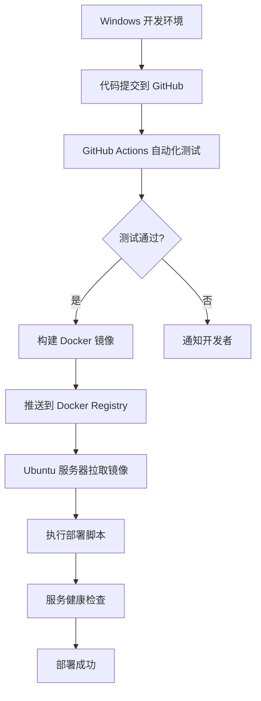

# Matrix Dashboard 项目 Windows 开发与 Ubuntu 部署指南

## 一、开发环境搭建（Windows）

### 1.1 必备软件安装

```bash
# 1. 安装 Node.js (推荐 20.x LTS)
# 下载地址：https://nodejs.org/
# 验证安装：
node --version
npm --version

# 2. 安装 Python 3.11+ (Synapse 依赖)
# 下载地址：https://www.python.org/downloads/
# 验证安装：
python --version
pip --version

# 3. 安装 Git
# 下载地址：https://git-scm.com/
# 验证安装：
git --version

# 4. 安装 Docker Desktop (推荐)
# 下载地址：https://www.docker.com/products/docker-desktop/
# 验证安装：
docker --version
docker-compose --version

# 5. 安装 PostgreSQL 15 (可选，也可用 Docker)
# 下载地址：https://www.postgresql.org/download/windows/

# 6. 安装 Redis (可选，也可用 Docker)
# 下载地址：https://github.com/microsoftarchive/redis/releases
```

### 1.2 项目目录结构

```bash
matrix-admin-system/
├── dashboard/                 # Dashboard 后端
│   ├── src/
│   ├── package.json
│   └── tsconfig.json
├── dashboard-frontend/        # Dashboard 前端
│   ├── src/
│   ├── package.json
│   └── vite.config.ts
├── synapse-custom/            # 修改后的 Synapse
│   ├── dashboard_integration/
│   └── 其他 Synapse 文件...
├── admin-bot/                 # 申诉 Bot
│   ├── src/
│   └── package.json
├── docker-compose.yml         # 开发环境
├── docker-compose.prod.yml    # 生产环境
├── migrations/                # 数据库迁移脚本
├── scripts/                   # 部署脚本
└── docs/                      # 文档
```

### 1.3 Windows 特定配置

#### PowerShell 脚本兼容性
```powershell
# 在 PowerShell 中执行以下命令以允许脚本运行
Set-ExecutionPolicy -ExecutionPolicy RemoteSigned -Scope CurrentUser

# 创建 Windows 兼容的启动脚本
# scripts/start-dev.ps1
$env:NODE_ENV = "development"
cd dashboard
npm run dev
```

#### 路径处理注意事项
```typescript
// 在代码中避免使用硬编码的 Windows 路径
// ❌ 错误做法
const configPath = 'C:\\Users\\Admin\\config.json';

// ✅ 正确做法
import path from 'path';
const configPath = path.join(process.cwd(), 'config', 'config.json');

// ✅ 或者使用环境变量
const configPath = process.env.CONFIG_PATH || './config/config.json';
```

#### 行尾序列处理
```bash
# 在 Git 中配置自动转换行尾序列
git config --global core.autocrlf true

# 或者在项目根目录创建 .gitattributes 文件
*.sh text eol=lf
*.ps1 text eol=crlf
```

---

## 二、Git 工作流和上游同步

### 2.1 仓库结构设计

```
GitHub Organization: your-org
├── matrix-dashboard           # 主仓库（这个项目）
├── synapse-fork               # Synapse 修改分支
└── element-web-fork          # Element Web 修改分支
```

### 2.2 开发工作流

```bash
# 1. Fork 主仓库到个人账户
git clone https://github.com/your-org/matrix-dashboard.git
cd matrix-dashboard

# 2. 创建功能分支
git checkout -b feature/user-management

# 3. 开发完成后提交
git add .
git commit -m "feat: 实现用户管理功能"
git push origin feature/user-management

# 4. 创建 Pull Request

# 5. 同步上游更改
git fetch upstream
git merge upstream/main
```

### 2.3 Synapse 修改的特殊处理

```bash
# Synapse 仓库的特殊同步流程
cd synapse-custom

# 添加上游仓库
git remote add upstream https://github.com/element-hq/synapse.git

# 获取上游更新
git fetch upstream

# 合并到你的分支
git checkout feature/dashboard-integration
git merge upstream/develop  # 或 main，取决于 Synapse 的分支策略

# 解决冲突后提交
git push origin feature/dashboard-integration
```

### 2.4 自动化同步脚本

```powershell
# scripts/sync-upstream.ps1 (Windows)
Write-Host "开始同步上游仓库..." -ForegroundColor Green

# 同步主项目
Write-Host "同步 matrix-dashboard..." -ForegroundColor Yellow
git fetch upstream
git merge upstream/main

# 同步 Synapse 分支
Write-Host "同步 synapse-custom..." -ForegroundColor Yellow
cd synapse-custom
git fetch upstream
git merge upstream/develop
cd ..

# 如果有 Element Web 修改
Write-Host "同步 element-web-custom..." -ForegroundColor Yellow
cd element-web-custom
git fetch upstream  
git merge upstream/develop
cd ..

Write-Host "同步完成！" -ForegroundColor Green
```

```bash
#!/bin/bash
# scripts/sync-upstream.sh (Linux)
echo "开始同步上游仓库..."

# 同步主项目
echo "同步 matrix-dashboard..."
git fetch upstream
git merge upstream/main

# 同步 Synapse 分支
echo "同步 synapse-custom..."
cd synapse-custom
git fetch upstream
git merge upstream/develop
cd ..

echo "同步完成！"
```

---

## 三、跨平台开发注意事项

### 3.1 环境变量管理

```typescript
// config/env.ts - 跨平台环境变量处理
export const getEnvVar = (key: string, defaultValue?: string): string => {
  const value = process.env[key];
  
  if (value === undefined) {
    if (defaultValue !== undefined) {
      return defaultValue;
    }
    throw new Error(`环境变量 ${key} 未设置`);
  }
  
  // Windows 和 Linux 路径处理
  if (key.includes('PATH') || key.includes('DIR')) {
    return value.replace(/\\/g, '/'); // 统一使用正斜杠
  }
  
  return value;
};

// 使用示例
export const DB_HOST = getEnvVar('DB_HOST', 'localhost');
export const DB_PORT = parseInt(getEnvVar('DB_PORT', '5432'));
export const REDIS_URL = getEnvVar('REDIS_URL', 'redis://localhost:6379');
```

### 3.2 文件系统操作

```typescript
// utils/fs-utils.ts - 跨平台文件操作
import fs from 'fs';
import path from 'path';

export class CrossPlatformFS {
  // 确保目录存在（跨平台）
  static ensureDir(dirPath: string): void {
    const normalizedPath = path.normalize(dirPath);
    
    if (!fs.existsSync(normalizedPath)) {
      fs.mkdirSync(normalizedPath, { recursive: true });
    }
  }

  // 跨平台路径连接
  static joinPaths(...paths: string[]): string {
    return path.join(...paths).replace(/\\/g, '/');
  }

  // 读取配置文件（考虑平台差异）
  static readConfig<T>(configPath: string): T {
    const fullPath = this.joinPaths(process.cwd(), configPath);
    
    if (!fs.existsSync(fullPath)) {
      throw new Error(`配置文件不存在: ${fullPath}`);
    }
    
    const content = fs.readFileSync(fullPath, 'utf-8');
    return JSON.parse(content);
  }
}
```

### 3.3 服务启动脚本

```json
// dashboard/package.json - 跨平台脚本定义
{
  "scripts": {
    "dev": "nodemon src/app.ts",
    "build": "tsc",
    "start": "node dist/app.js",
    "start:windows": "set NODE_ENV=production&& node dist/app.js",
    "start:linux": "NODE_ENV=production node dist/app.js",
    "test": "jest",
    "test:windows": "set NODE_ENV=test&& jest",
    "test:linux": "NODE_ENV=test jest"
  }
}
```

---

## 四、Ubuntu 生产环境部署

### 4.1 服务器准备脚本

```bash
#!/bin/bash
# scripts/setup-ubuntu-server.sh

set -e

echo "开始设置 Ubuntu 服务器..."

# 更新系统
sudo apt update && sudo apt upgrade -y

# 安装 Docker
curl -fsSL https://get.docker.com -o get-docker.sh
sudo sh get-docker.sh
sudo usermod -aG docker $USER

# 安装 Docker Compose
sudo curl -L "https://github.com/docker/compose/releases/download/v2.24.0/docker-compose-$(uname -s)-$(uname -m)" -o /usr/local/bin/docker-compose
sudo chmod +x /usr/local/bin/docker-compose

# 安装 Git
sudo apt install git -y

# 创建应用目录
sudo mkdir -p /opt/matrix-dashboard
sudo chown $USER:$USER /opt/matrix-dashboard

echo "服务器设置完成！请重新登录以应用 Docker 组权限更改。"
```

### 4.2 生产环境 Docker Compose

```yaml
# docker-compose.prod.yml
version: '3.8'

services:
  postgres:
    image: postgres:15
    environment:
      POSTGRES_DB: synapse
      POSTGRES_USER: synapse
      POSTGRES_PASSWORD: ${DB_PASSWORD}
    volumes:
      - postgres_data:/var/lib/postgresql/data
      - ./migrations:/docker-entrypoint-initdb.d
    networks:
      - matrix-network
    restart: unless-stopped

  redis:
    image: redis:7-alpine
    command: redis-server --appendonly yes
    volumes:
      - redis_data:/data
    networks:
      - matrix-network
    restart: unless-stopped

  minio:
    image: minio/minio
    environment:
      MINIO_ROOT_USER: ${MINIO_ROOT_USER}
      MINIO_ROOT_PASSWORD: ${MINIO_ROOT_PASSWORD}
    command: server /data --console-address ":9001"
    volumes:
      - minio_data:/data
    networks:
      - matrix-network
    restart: unless-stopped

  dashboard:
    build:
      context: ./dashboard
      dockerfile: Dockerfile.prod
    environment:
      NODE_ENV: production
      DB_HOST: postgres
      DB_PORT: 5432
      DB_USER: synapse
      DB_PASSWORD: ${DB_PASSWORD}
      REDIS_HOST: redis
      REDIS_PORT: 6379
      JWT_SECRET: ${JWT_SECRET}
    ports:
      - "3000:3000"
    depends_on:
      - postgres
      - redis
    networks:
      - matrix-network
    restart: unless-stopped

  admin-bot:
    build:
      context: ./admin-bot
      dockerfile: Dockerfile.prod
    environment:
      BOT_ACCESS_TOKEN: ${BOT_ACCESS_TOKEN}
      DASHBOARD_API_URL: http://dashboard:3000/api/v1
    depends_on:
      - dashboard
    networks:
      - matrix-network
    restart: unless-stopped

  nginx:
    image: nginx:alpine
    ports:
      - "80:80"
      - "443:443"
    volumes:
      - ./nginx/nginx.conf:/etc/nginx/nginx.conf
      - ./ssl:/etc/nginx/ssl
    depends_on:
      - dashboard
    networks:
      - matrix-network
    restart: unless-stopped

volumes:
  postgres_data:
  redis_data:
  minio_data:

networks:
  matrix-network:
    driver: bridge
```

### 4.3 部署脚本

```bash
#!/bin/bash
# scripts/deploy.sh

set -e

echo "开始部署 Matrix Dashboard..."

# 加载环境变量
if [ -f .env ]; then
  export $(cat .env | grep -v '^#' | xargs)
else
  echo "错误: .env 文件不存在"
  exit 1
fi

# 拉取最新代码
echo "拉取最新代码..."
git pull origin main

# 构建和启动服务
echo "构建和启动服务..."
docker-compose -f docker-compose.prod.yml down
docker-compose -f docker-compose.prod.yml build --no-cache
docker-compose -f docker-compose.prod.yml up -d

# 等待服务启动
echo "等待服务启动..."
sleep 30

# 运行数据库迁移
echo "运行数据库迁移..."
docker-compose -f docker-compose.prod.yml exec postgres psql -U synapse -d synapse -f /docker-entrypoint-initdb.d/001_create_dashboard_schema.sql

# 健康检查
echo "执行健康检查..."
curl -f http://localhost:3000/health || {
  echo "健康检查失败!"
  exit 1
}

echo "部署完成！"
```

### 4.4 Nginx 配置

```nginx
# nginx/nginx.conf
events {
    worker_connections 1024;
}

http {
    upstream dashboard {
        server dashboard:3000;
    }

    server {
        listen 80;
        server_name your-domain.com;
        return 301 https://$server_name$request_uri;
    }

    server {
        listen 443 ssl http2;
        server_name your-domain.com;

        ssl_certificate /etc/nginx/ssl/cert.pem;
        ssl_certificate_key /etc/nginx/ssl/key.pem;

        # 安全头部
        add_header Strict-Transport-Security "max-age=31536000; includeSubDomains" always;
        add_header X-Frame-Options "SAMEORIGIN" always;
        add_header X-Content-Type-Options "nosniff" always;
        add_header X-XSS-Protection "1; mode=block" always;

        # Dashboard API
        location /api/ {
            proxy_pass http://dashboard;
            proxy_set_header Host $host;
            proxy_set_header X-Real-IP $remote_addr;
            proxy_set_header X-Forwarded-For $proxy_add_x_forwarded_for;
            proxy_set_header X-Forwarded-Proto $scheme;
        }

        # 静态文件
        location / {
            root /usr/share/nginx/html;
            try_files $uri $uri/ /index.html;
        }
    }
}
```

---

## 五、开发到生产流程

### 5.1 完整的开发部署流程



### 5.2 GitHub Actions 工作流

```yaml
# .github/workflows/ci-cd.yml
name: CI/CD Pipeline

on:
  push:
    branches: [ main ]
  pull_request:
    branches: [ main ]

jobs:
  test:
    runs-on: ubuntu-latest
    
    services:
      postgres:
        image: postgres:15
        env:
          POSTGRES_PASSWORD: postgres
        options: >-
          --health-cmd pg_isready
          --health-interval 10s
          --health-timeout 5s
          --health-retries 5
        ports:
          - 5432:5432
      
      redis:
        image: redis:7-alpine
        options: >-
          --health-cmd "redis-cli ping"
          --health-interval 10s
          --health-timeout 5s
          --health-retries 5
        ports:
          - 6379:6379

    steps:
    - uses: actions/checkout@v3
    
    - name: Setup Node.js
      uses: actions/setup-node@v3
      with:
        node-version: '20'
        cache: 'npm'
        cache-dependency-path: dashboard/package-lock.json
    
    - name: Install dependencies
      run: |
        cd dashboard
        npm ci
    
    - name: Run tests
      run: |
        cd dashboard
        npm test
      env:
        NODE_ENV: test
        DB_HOST: localhost
        DB_PORT: 5432
        DB_USER: postgres
        DB_PASSWORD: postgres
        REDIS_HOST: localhost
        REDIS_PORT: 6379

  build-and-deploy:
    needs: test
    runs-on: ubuntu-latest
    if: github.ref == 'refs/heads/main'
    
    steps:
    - uses: actions/checkout@v3
    
    - name: Build Docker images
      run: |
        docker build -t your-registry/matrix-dashboard:latest -f dashboard/Dockerfile.prod ./dashboard
        docker build -t your-registry/admin-bot:latest -f admin-bot/Dockerfile.prod ./admin-bot
    
    - name: Push to Docker Registry
      run: |
        echo ${{ secrets.DOCKER_PASSWORD }} | docker login -u ${{ secrets.DOCKER_USERNAME }} --password-stdin
        docker push your-registry/matrix-dashboard:latest
        docker push your-registry/admin-bot:latest
    
    - name: Deploy to production
      uses: appleboy/ssh-action@v0.1.7
      with:
        host: ${{ secrets.SERVER_HOST }}
        username: ${{ secrets.SERVER_USERNAME }}
        key: ${{ secrets.SERVER_SSH_KEY }}
        script: |
          cd /opt/matrix-dashboard
          ./scripts/deploy.sh
```

---

## 六、故障排除和监控

### 6.1 日志管理

```bash
#!/bin/bash
# scripts/logs.sh - 生产环境日志查看

case $1 in
  "dashboard")
    docker-compose -f docker-compose.prod.yml logs -f dashboard
    ;;
  "postgres")
    docker-compose -f docker-compose.prod.yml logs -f postgres
    ;;
  "redis")
    docker-compose -f docker-compose.prod.yml logs -f redis
    ;;
  "bot")
    docker-compose -f docker-compose.prod.yml logs -f admin-bot
    ;;
  "all")
    docker-compose -f docker-compose.prod.yml logs -f
    ;;
  *)
    echo "用法: ./scripts/logs.sh [dashboard|postgres|redis|bot|all]"
    ;;
esac
```

### 6.2 健康检查 API

```typescript
// dashboard/src/routes/health.ts
import express from 'express';
import { pool } from '../config/database';
import { redis } from '../config/redis';

const router = express.Router();

router.get('/health', async (req, res) => {
  const checks = {
    database: 'unknown',
    redis: 'unknown',
    api: 'healthy'
  };

  try {
    // 检查数据库连接
    await pool.query('SELECT 1');
    checks.database = 'healthy';
  } catch (error) {
    checks.database = 'unhealthy';
    console.error('数据库健康检查失败:', error);
  }

  try {
    // 检查 Redis 连接
    await redis.ping();
    checks.redis = 'healthy';
  } catch (error) {
    checks.redis = 'unhealthy';
    console.error('Redis 健康检查失败:', error);
  }

  const allHealthy = Object.values(checks).every(status => status === 'healthy');
  
  res.status(allHealthy ? 200 : 503).json({
    status: allHealthy ? 'healthy' : 'degraded',
    checks,
    timestamp: new Date().toISOString(),
    version: process.env.npm_package_version || 'unknown'
  });
});

export default router;
```

### 6.3 备份和恢复脚本

```bash
#!/bin/bash
# scripts/backup.sh

set -e

BACKUP_DIR="/opt/matrix-dashboard/backups"
DATE=$(date +%Y%m%d_%H%M%S)

echo "开始备份..."

# 创建备份目录
mkdir -p $BACKUP_DIR

# 备份 PostgreSQL
docker-compose -f docker-compose.prod.yml exec -T postgres pg_dump -U synapse synapse > $BACKUP_DIR/synapse_$DATE.sql

# 备份 Redis
docker-compose -f docker-compose.prod.yml exec -T redis redis-cli SAVE
docker cp $(docker-compose -f docker-compose.prod.yml ps -q redis):/data/dump.rdb $BACKUP_DIR/redis_$DATE.rdb

# 压缩备份
tar -czf $BACKUP_DIR/backup_$DATE.tar.gz $BACKUP_DIR/synapse_$DATE.sql $BACKUP_DIR/redis_$DATE.rdb

# 清理临时文件
rm $BACKUP_DIR/synapse_$DATE.sql $BACKUP_DIR/redis_$DATE.rdb

echo "备份完成: $BACKUP_DIR/backup_$DATE.tar.gz"
```

---

## 七、安全注意事项

### 7.1 环境变量安全

```bash
# .env.example - 模板文件（不含真实值）
DB_PASSWORD=your_secure_password_here
JWT_SECRET=your_jwt_secret_here
MINIO_ROOT_USER=minioadmin
MINIO_ROOT_PASSWORD=your_minio_password_here
BOT_ACCESS_TOKEN=your_bot_access_token_here

# 生产环境使用
chmod 600 .env  # 确保只有所有者可读
```

### 7.2 防火墙配置

```bash
# scripts/configure-firewall.sh
#!/bin/bash

# 启用 UFW
sudo ufw enable

# 允许 SSH
sudo ufw allow 22

# 允许 HTTP/HTTPS
sudo ufw allow 80
sudo ufw allow 443

# 允许 Synapse 端口（如果需要）
sudo ufw allow 8008
sudo ufw allow 8448

# 拒绝其他所有入站连接
sudo ufw default deny incoming

# 显示规则
sudo ufw status verbose
```

### 7.3 SSL 证书

```bash
# scripts/setup-ssl.sh
#!/bin/bash

# 使用 Let's Encrypt 获取 SSL 证书
sudo apt install certbot -y

# 获取证书（需要域名已指向服务器）
sudo certbot certonly --standalone -d your-domain.com

# 创建软链接到 nginx 目录
sudo mkdir -p /opt/matrix-dashboard/ssl
sudo ln -sf /etc/letsencrypt/live/your-domain.com/fullchain.pem /opt/matrix-dashboard/ssl/cert.pem
sudo ln -sf /etc/letsencrypt/live/your-domain.com/privkey.pem /opt/matrix-dashboard/ssl/key.pem

# 设置自动续期
echo "0 12 * * * /usr/bin/certbot renew --quiet" | sudo crontab -
```

---

## 八、常见问题解决

### 8.1 Windows 特定问题

**问题 1: Docker 端口被占用**
```powershell
# 查找占用端口的进程
netstat -ano | findstr :3000

# 终止进程
taskkill /PID <PID> /F
```

**问题 2: 文件权限问题**
```powershell
# 修复 Git 文件权限
git config --global core.filemode false

# 重置文件权限
git reset --hard HEAD
```

**问题 3: 行尾序列警告**
```bash
# 在项目根目录创建 .gitattributes
* text=auto
*.sh text eol=lf
*.ps1 text eol=crlf
```

### 8.2 Ubuntu 部署问题

**问题 1: 内存不足**
```bash
# 创建交换文件
sudo fallocate -l 2G /swapfile
sudo chmod 600 /swapfile
sudo mkswap /swapfile
sudo swapon /swapfile

# 永久生效
echo '/swapfile none swap sw 0 0' | sudo tee -a /etc/fstab
```

**问题 2: Docker 容器无法启动**
```bash
# 查看详细日志
docker-compose -f docker-compose.prod.yml logs service_name

# 检查容器状态
docker-compose -f docker-compose.prod.yml ps

# 重启服务
docker-compose -f docker-compose.prod.yml restart service_name
```

**问题 3: 数据库连接失败**
```bash
# 检查 PostgreSQL 连接
docker-compose -f docker-compose.prod.yml exec postgres psql -U synapse -d synapse -c "SELECT 1;"

# 检查网络
docker network ls
docker-compose -f docker-compose.prod.yml network inspect matrix-network
```

---
